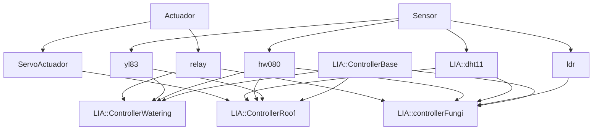
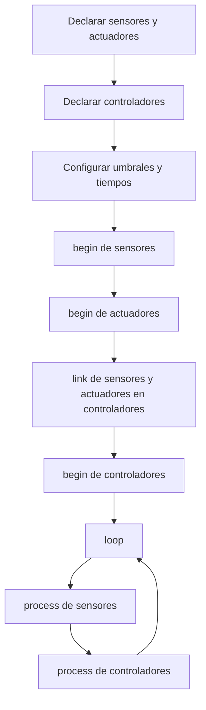

# 🌱 LIA Arduino

> **Librería Invernadero Automatizado — LIA**
> Librería orientada a objetos para el control de invernaderos inteligentes con microcontroladores de la familia Arduino.

---

## Información de la librería

| Campo                | Valor                                    |
| -------------------- | ---------------------------------------- |
| Nombre declarado     | `LIA Arduino`                            |
| Versión              | `1.0.0`                                  |
| Autor                | `Gael, Jael & Baltman`                   |
| Maintainer           | `theBaltman04 <bzamudio208@uvaq.edu.mx>` |
| Categoría            | `Device Control`                         |
| Arquitecturas        | `*`                                      |
| Encabezado principal | `#include <lia.h>`                       |

---

## Descripción general

**LIA Arduino** es una librería para implementar sistemas de automatización de invernaderos utilizando una arquitectura basada en:

* Sensores.
* Actuadores.
* Controladores.
* Lógica de control encapsulada en clases.

La librería permite trabajar con sensores de humedad de suelo, lluvia, temperatura, humedad ambiental y luminosidad, además de actuadores como relés y servomotores.

Su estructura está pensada para crear sistemas de control como:

* Riego automático.
* Apertura o cierre automático de techo.
* Control de lámpara UV para cultivo de hongos.
* Sistemas integrados de monitoreo y control.

---

## Instalación

1. Descarga la librería.
2. Copia la carpeta de la librería dentro de la carpeta de librerías de Arduino:

```text
Documentos/Arduino/libraries/
```

3. Reinicia el IDE de Arduino.
4. Incluye la librería en tu sketch:

```cpp
#include <lia.h>
```

---

## Dependencias

La librería utiliza encabezados externos que deben estar disponibles en el entorno de Arduino.

| Dependencia | Uso dentro de la librería                                                                                                                           |
| ----------- | --------------------------------------------------------------------------------------------------------------------------------------------------- |
| `Arduino.h` | Funciones base de Arduino: `pinMode()`, `digitalRead()`, `digitalWrite()`, `analogRead()`, `millis()`, tipos como `uint8_t`, `uint16_t`, `uint32_t` |
| `Servo.h`   | Control de servomotor mediante la clase `ServoActuador`                                                                                             |
| `DHT11.h`   | Lectura del sensor DHT11 mediante la clase `LIA::dht11`                                                                                             |

> [!IMPORTANT]
> Si tu sketch utiliza `ServoActuador`, necesitas tener disponible la librería `Servo`.
> Si utilizas `LIA::dht11`, necesitas tener disponible la librería `DHT11`.

---

## Arquitectura interna

La librería está organizada alrededor de tres tipos principales:



---

## Estructura principal

```text
src/
├── lia.h
├── sensor/
│   ├── sensor.h
│   └── sensor.cpp
├── actuador/
│   ├── actuador.h
│   └── actuador.cpp
├── hw080/
│   ├── hw080.h
│   └── hw080.cpp
├── yl83/
│   ├── yl83.h
│   └── yl83.cpp
├── ldr/
│   ├── ldr.h
│   └── ldr.cpp
├── dht11/
│   ├── dht11.h
│   └── dht11.cpp
├── relay/
│   ├── relay.h
│   └── relay.cpp
├── servo/
│   ├── servo.h
│   └── servo.cpp
└── controller/
    ├── controller.h
    ├── controller_base.h
    ├── controller_base.cpp
    ├── controller_watering.h
    ├── controller_watering.cpp
    ├── controller_roof.h
    ├── controller_roof.cpp
    └── controller_fungi/
        ├── controller_fungi.h
        └── controller_fungi.cpp
```

---

## Consideraciones importantes de uso

### 1. La librería está diseñada para la familia Arduino

La librería utiliza la API estándar de Arduino:

```cpp
pinMode();
digitalRead();
digitalWrite();
analogRead();
millis();
Serial.print();
Serial.println();
```

También utiliza tipos propios del entorno Arduino:

```cpp
uint8_t
uint16_t
uint32_t
```

---

### 2. Conversión ADC de 10 bits

Las clases `hw080` y `ldr` trabajan con lecturas analógicas obtenidas mediante `analogRead()`.

En el caso de `hw080`, el porcentaje se calcula explícitamente usando una escala de **0 a 1023**:

```cpp
_humedadP = analogRead(_pin) * (100.0 / 1023.0);
_humedadP = 100 - _humedadP;
```

Por lo tanto, la conversión está diseñada para un ADC de **10 bits**.

> [!IMPORTANT]
> En placas donde `analogRead()` no entregue valores de `0` a `1023`, las lecturas de humedad del suelo y el umbral del LDR pueden requerir ajustes externos o configuración adicional de resolución, dependiendo de la placa usada.

---

### 3. Los sensores deben actualizarse manualmente

La librería no actualiza sensores automáticamente.

Cada sensor tiene un método:

```cpp
process();
```

Este método debe ejecutarse de forma periódica en el `loop()` antes de usar sus lecturas o antes de ejecutar controladores.

Ejemplo:

```cpp
suelo.process();
lluvia.process();
clima.process();
luz.process();

watering.process();
roof.process();
fungi.process();
```

---

### 4. Los controladores no crean sensores ni actuadores

Los controladores trabajan con punteros internos a sensores y actuadores.
Es obligatorio enlazar cada sensor y actuador antes de ejecutar `process()`.

Ejemplo:

```cpp
watering.linkRainSensor(lluvia);
watering.linkSoilHumiditySensor(suelo);
watering.linkWaterPump(bomba);
```

> [!WARNING]
> Si se ejecuta `process()` en un controlador sin haber enlazado antes todos los sensores y actuadores requeridos, el controlador intentará acceder a punteros no válidos.

---

### 5. No hay validación interna de punteros en los controladores

Los controladores obtienen sensores y actuadores mediante:

```cpp
getSensor(index);
getActuador(index);
```

Después hacen conversiones directas de tipo, por ejemplo:

```cpp
yl83* rainSensor = (yl83*)ControllerBase::getSensor(0);
hw080* soilSensor = (hw080*)ControllerBase::getSensor(1);
relay* waterPump = (relay*)ControllerBase::getActuador(0);
```

Esto significa que:

* El usuario debe enlazar el tipo correcto de sensor.
* El usuario debe enlazar el tipo correcto de actuador.
* El usuario debe respetar el orden interno esperado por cada controlador.
* No se valida si el puntero es nulo.
* No se valida si el tipo enlazado coincide con el tipo usado internamente.

---

### 6. Orden recomendado de ejecución

```cpp
#include <lia.h>

using namespace LIA;

hw080 suelo(A0);
yl83 lluvia(2);
relay bomba(8);

ControllerWatering watering;

void setup() {
    suelo.begin();
    lluvia.begin();
    bomba.begin();

    watering.linkRainSensor(lluvia);
    watering.linkSoilHumiditySensor(suelo);
    watering.linkWaterPump(bomba);

    watering.begin();
}

void loop() {
    suelo.process();
    lluvia.process();

    watering.process();
}
```

---

### 7. El relé trabaja con lógica activa en LOW

La clase `relay` implementa:

| Acción       | Escritura digital | Estado interno |
| ------------ | ----------------: | -------------: |
| `encender()` |             `LOW` |         `true` |
| `apagar()`   |            `HIGH` |        `false` |

> [!NOTE]
> Esta implementación corresponde a módulos de relé activos en nivel bajo. Si tu módulo de relé es activo en nivel alto, el comportamiento físico puede quedar invertido.

---

### 8. El sensor YL83 interpreta lluvia con lógica invertida

La clase `yl83` actualiza su estado así:

```cpp
_llueve = !digitalRead(_pin);
```

Por lo tanto:

| Lectura digital | Resultado de `estaLloviendo()` |
| --------------: | -----------------------------: |
|           `LOW` |                         `true` |
|          `HIGH` |                        `false` |

---

### 9. El sensor HW080 invierte el porcentaje de humedad

El sensor de humedad de suelo `hw080` calcula primero un porcentaje con base en el ADC y después invierte el valor:

```cpp
_humedadP = 100 - _humedadP;
```

Interpretación usada por la librería:

| Resultado | Interpretación |
| --------: | -------------- |
|     `0 %` | Seco           |
|   `100 %` | Húmedo         |

---

### 10. El DHT11 no actualiza en cada llamada a `process()`

La clase `LIA::dht11` tiene un periodo interno de lectura de:

```text
2000 ms
```

Sólo intenta leer el sensor cuando se cumple:

```cpp
millis() - _startTime >= _periodMs
```

> [!IMPORTANT]
> Si llamas `process()` muchas veces por segundo, el DHT11 no se leerá en cada llamada. La actualización está limitada internamente a intervalos de 2 segundos.

---

### 11. El DHT11 imprime errores por Serial

Cuando la lectura del DHT11 falla, se ejecuta:

```cpp
Serial.print(millis());
Serial.print(" --> DHT11 Error: ");
Serial.println(_dhtReading);
```

> [!NOTE]
> Si quieres ver esos errores, inicializa el puerto serial en tu sketch con `Serial.begin(...)`.

---

### 12. Valores iniciales antes de la primera lectura del DHT11

En el constructor de `LIA::dht11` se configuran umbrales y temporización, pero las variables de temperatura y humedad se actualizan cuando hay una lectura exitosa en `process()`.

> [!WARNING]
> Antes de que ocurra la primera lectura válida del DHT11, evita depender de `getTemperatura()`, `getHumedad()`, `haceCalor()`, `haceFrio()`, `muchaHumedad()` o `pocaHumedad()` para decisiones críticas.

---

### 13. `ControllerBase` no valida límites de índice

Los métodos:

```cpp
addSenPtr(Sensor* s, uint8_t index);
addActPtr(Actuador* a, uint8_t index);
getSensor(uint8_t index) const;
getActuador(uint8_t index) const;
```

acceden directamente a arreglos internos.

> [!WARNING]
> Usar índices fuera del tamaño configurado en el constructor del controlador puede provocar comportamiento indefinido.

---

### 14. Los métodos `begin()` de algunos sensores/controladores no configuran hardware

Algunas clases tienen `begin()` vacío:

| Clase                     | `begin()` |
| ------------------------- | --------- |
| `hw080`                   | Vacío     |
| `ldr`                     | Vacío     |
| `LIA::dht11`              | Vacío     |
| `LIA::ControllerWatering` | Vacío     |
| `LIA::ControllerRoof`     | Vacío     |
| `LIA::controllerFungi`    | Vacío     |

Aun así, se recomienda llamarlo para mantener una estructura uniforme y facilitar futuras modificaciones de la librería.

---

### 15. Detalle importante de `ldr::setDisparo()`

El método está implementado así:

```cpp
void ldr::setDisparo(uint16_t d){
    if(d > 1023) d = 1023;
    else if(d < 0) d = 0;
    else _disparo = d;
}
```

Debido a que `d` es `uint16_t`, no puede ser menor que `0`. Además, cuando `d > 1023`, el valor local se cambia a `1023`, pero `_disparo` no se actualiza dentro de esa rama.

> [!WARNING]
> En la implementación actual, usa valores de `0` a `1023` al llamar `setDisparo()`. Evita pasar valores mayores a `1023`.

---

## Flujo recomendado para un proyecto



---

## Sensores incluidos

| Clase        | Tipo                            | Pin usado |
| ------------ | ------------------------------- | --------- |
| `hw080`      | Humedad de suelo                | Analógico |
| `yl83`       | Lluvia                          | Digital   |
| `ldr`        | Luminosidad                     | Analógico |
| `LIA::dht11` | Temperatura y humedad ambiental | Digital   |

---

## Actuadores incluidos

| Clase           | Tipo               | Pin usado   |
| --------------- | ------------------ | ----------- |
| `relay`         | Relé activo en LOW | Digital     |
| `ServoActuador` | Servomotor         | PWM / Servo |

---

## Controladores incluidos

| Clase                     | Función                                         |
| ------------------------- | ----------------------------------------------- |
| `LIA::ControllerWatering` | Control automático de bomba de riego            |
| `LIA::ControllerRoof`     | Control automático de techo mediante servomotor |
| `LIA::controllerFungi`    | Control de lámpara UV para cultivo de hongos    |

---

# API

---

## Clase `Sensor`

Clase base abstracta para sensores.

| Método                       | Descripción                                                                             | Ejemplo de uso                   |
| ---------------------------- | --------------------------------------------------------------------------------------- | -------------------------------- |
| `Sensor()`                   | Constructor base de sensor.                                                             | `Sensor` se usa como clase base. |
| `virtual void begin() = 0`   | Método virtual puro para inicializar un sensor. Debe implementarse en clases derivadas. | `sensor.begin();`                |
| `virtual void process() = 0` | Método virtual puro para actualizar el sensor. Debe implementarse en clases derivadas.  | `sensor.process();`              |

---

## Clase `hw080`

Sensor de humedad de suelo basado en lectura analógica.

### Valores internos por defecto

| Parámetro       | Valor |
| --------------- | ----: |
| Humedad inicial |   `0` |
| Humedad máxima  |  `80` |
| Humedad mínima  |  `10` |

| Método                            | Descripción                                                                                                                                             | Ejemplo de uso                      |
| --------------------------------- | ------------------------------------------------------------------------------------------------------------------------------------------------------- | ----------------------------------- |
| `hw080(uint8_t p)`                | Constructor. Recibe el pin analógico del sensor.                                                                                                        | `hw080 suelo(A0);`                  |
| `void begin()`                    | Método de inicialización. En la implementación actual no realiza configuración adicional.                                                               | `suelo.begin();`                    |
| `void process()`                  | Lee el pin con `analogRead()`, convierte la lectura a porcentaje usando escala `0-1023` e invierte el resultado para que `0%` sea seco y `100%` húmedo. | `suelo.process();`                  |
| `float getPorHum() const`         | Devuelve el porcentaje de humedad calculado.                                                                                                            | `float h = suelo.getPorHum();`      |
| `uint8_t getMaxHum() const`       | Devuelve el umbral máximo de humedad.                                                                                                                   | `uint8_t maxH = suelo.getMaxHum();` |
| `uint8_t getMinHum() const`       | Devuelve el umbral mínimo de humedad.                                                                                                                   | `uint8_t minH = suelo.getMinHum();` |
| `void setMaxHum(uint8_t percent)` | Configura el umbral máximo de humedad si el valor está entre `0` y `100`.                                                                               | `suelo.setMaxHum(80);`              |
| `void setMinHum(uint8_t percent)` | Configura el umbral mínimo de humedad si el valor está entre `0` y `100`.                                                                               | `suelo.setMinHum(35);`              |

> [!NOTE]
> `setMaxHum()` y `setMinHum()` no validan que el mínimo sea menor que el máximo. Esa coherencia debe cuidarse desde el sketch del usuario.

---

## Clase `yl83`

Sensor digital de lluvia.

| Método                       | Descripción                                                                                       | Ejemplo de uso                    |
| ---------------------------- | ------------------------------------------------------------------------------------------------- | --------------------------------- |
| `yl83(uint8_t p)`            | Constructor. Recibe el pin digital del sensor. Inicializa el estado interno de lluvia en `false`. | `yl83 lluvia(2);`                 |
| `void begin()`               | Configura el pin como entrada mediante `pinMode(_pin, INPUT)`.                                    | `lluvia.begin();`                 |
| `void process()`             | Lee el pin digital e invierte la lectura. Si el pin está en `LOW`, `_llueve` queda en `true`.     | `lluvia.process();`               |
| `bool estaLloviendo() const` | Devuelve el estado interno de lluvia.                                                             | `if (lluvia.estaLloviendo()) { }` |

---

## Clase `ldr`

Sensor analógico de luminosidad.

### Valores internos por defecto

| Parámetro         | Valor |
| ----------------- | ----: |
| Lectura inicial   |   `0` |
| Umbral de disparo | `200` |

| Método                        | Descripción                                                                                                                            | Ejemplo de uso                    |
| ----------------------------- | -------------------------------------------------------------------------------------------------------------------------------------- | --------------------------------- |
| `ldr(uint8_t p)`              | Constructor. Recibe el pin analógico del LDR.                                                                                          | `ldr luz(A1);`                    |
| `void begin()`                | Método de inicialización. En la implementación actual no realiza configuración adicional.                                              | `luz.begin();`                    |
| `void process()`              | Actualiza la lectura analógica interna mediante `analogRead(_pin)`.                                                                    | `luz.process();`                  |
| `void setDisparo(uint16_t d)` | Configura el umbral de disparo para determinar si es de noche. En la implementación actual se recomienda usar valores de `0` a `1023`. | `luz.setDisparo(200);`            |
| `uint16_t getRawLux()`        | Devuelve la lectura analógica almacenada.                                                                                              | `uint16_t raw = luz.getRawLux();` |
| `uint16_t getDisparo() const` | Devuelve el umbral de disparo configurado.                                                                                             | `uint16_t u = luz.getDisparo();`  |
| `bool esNoche() const`        | Devuelve `true` si la lectura analógica es menor o igual al umbral de disparo.                                                         | `if (luz.esNoche()) { }`          |

---

## Clase `LIA::dht11`

Sensor DHT11 para temperatura y humedad ambiental.

### Valores internos por defecto

| Parámetro          |     Valor |
| ------------------ | --------: |
| Periodo de lectura | `2000 ms` |
| Temperatura alta   |      `37` |
| Temperatura baja   |      `15` |
| Humedad alta       |      `80` |
| Humedad baja       |      `40` |

| Método                                                                                   | Descripción                                                                                                                                                                                           | Ejemplo de uso                           |
| ---------------------------------------------------------------------------------------- | ----------------------------------------------------------------------------------------------------------------------------------------------------------------------------------------------------- | ---------------------------------------- |
| `dht11(uint8_t p)`                                                                       | Constructor. Recibe el pin digital del DHT11 e inicializa el objeto interno `DHT11`.                                                                                                                  | `LIA::dht11 clima(4);`                   |
| `void begin()`                                                                           | Método de inicialización. En la implementación actual no realiza configuración adicional.                                                                                                             | `clima.begin();`                         |
| `void process()`                                                                         | Cada `2000 ms` intenta leer temperatura y humedad usando `readTemperatureHumidity(a, b)`. Si la lectura es correcta, actualiza los valores internos. Si falla, imprime el código de error por Serial. | `clima.process();`                       |
| `void setThresholds(uint8_t highTemp, uint8_t lowTemp, uint8_t highHum, uint8_t lowHum)` | Configura los umbrales de temperatura alta, temperatura baja, humedad alta y humedad baja.                                                                                                            | `clima.setThresholds(30, 15, 85, 40);`   |
| `bool haceCalor() const`                                                                 | Devuelve `true` si la temperatura es mayor o igual al umbral alto.                                                                                                                                    | `if (clima.haceCalor()) { }`             |
| `bool haceFrio() const`                                                                  | Devuelve `true` si la temperatura es menor o igual al umbral bajo.                                                                                                                                    | `if (clima.haceFrio()) { }`              |
| `bool muchaHumedad() const`                                                              | Devuelve `true` si la humedad es mayor o igual al umbral alto de humedad.                                                                                                                             | `if (clima.muchaHumedad()) { }`          |
| `bool pocaHumedad() const`                                                               | Devuelve `true` si la humedad es menor o igual al umbral bajo de humedad.                                                                                                                             | `if (clima.pocaHumedad()) { }`           |
| `uint8_t getTemperatura() const`                                                         | Devuelve la última temperatura almacenada.                                                                                                                                                            | `uint8_t t = clima.getTemperatura();`    |
| `uint8_t getHumedad() const`                                                             | Devuelve la última humedad almacenada.                                                                                                                                                                | `uint8_t h = clima.getHumedad();`        |
| `uint8_t getMaxhumidity() const`                                                         | Devuelve el umbral alto de humedad.                                                                                                                                                                   | `uint8_t hMax = clima.getMaxhumidity();` |
| `uint8_t getMaxTemp() const`                                                             | Devuelve el umbral alto de temperatura.                                                                                                                                                               | `uint8_t tMax = clima.getMaxTemp();`     |
| `uint8_t getMinTemp() const`                                                             | Devuelve el umbral bajo de temperatura.                                                                                                                                                               | `uint8_t tMin = clima.getMinTemp();`     |
| `uint8_t getMinHumidity() const`                                                         | Devuelve el umbral bajo de humedad.                                                                                                                                                                   | `uint8_t hMin = clima.getMinHumidity();` |

---

## Clase `Actuador`

Clase base abstracta para actuadores.

| Método                        | Descripción                                        | Ejemplo de uso                     |
| ----------------------------- | -------------------------------------------------- | ---------------------------------- |
| `Actuador()`                  | Constructor base. Inicializa `_activo` en `false`. | `Actuador` se usa como clase base. |
| `bool estado() const`         | Devuelve el estado lógico interno del actuador.    | `bool activo = bomba.estado();`    |
| `virtual void begin() = 0`    | Método virtual puro para inicializar el actuador.  | `actuador.begin();`                |
| `virtual void encender() = 0` | Método virtual puro para activar el actuador.      | `actuador.encender();`             |
| `virtual void apagar() = 0`   | Método virtual puro para desactivar el actuador.   | `actuador.apagar();`               |

---

## Clase `relay`

Actuador para relé con lógica activa en LOW.

| Método                | Descripción                                                                   | Ejemplo de uso            |
| --------------------- | ----------------------------------------------------------------------------- | ------------------------- |
| `relay(uint8_t p)`    | Constructor. Recibe el pin digital del relé.                                  | `relay bomba(8);`         |
| `void begin()`        | Configura el pin como salida mediante `pinMode(_pin, OUTPUT)`.                | `bomba.begin();`          |
| `void encender()`     | Activa el relé escribiendo `LOW` en el pin y establece `_activo = true`.      | `bomba.encender();`       |
| `void apagar()`       | Desactiva el relé escribiendo `HIGH` en el pin y establece `_activo = false`. | `bomba.apagar();`         |
| `bool estado() const` | Método heredado de `Actuador`. Devuelve el estado interno `_activo`.          | `if (bomba.estado()) { }` |

---

## Clase `ServoActuador`

Actuador para controlar un servomotor.

| Método                                                                     | Descripción                                                                                                     | Ejemplo de uso                   |
| -------------------------------------------------------------------------- | --------------------------------------------------------------------------------------------------------------- | -------------------------------- |
| `ServoActuador(uint8_t pin, uint8_t anguloInactivo, uint8_t anguloActivo)` | Constructor. Recibe el pin del servo, el ángulo inactivo y el ángulo activo.                                    | `ServoActuador techo(9, 0, 90);` |
| `void begin()`                                                             | Asocia el servo al pin mediante `attach()`, escribe el ángulo inactivo y establece `_activo = false`.           | `techo.begin();`                 |
| `void encender()`                                                          | Si el servo no está asociado, lo asocia al pin. Luego escribe el ángulo activo y establece `_activo = true`.    | `techo.encender();`              |
| `void apagar()`                                                            | Si el servo no está asociado, lo asocia al pin. Luego escribe el ángulo inactivo y establece `_activo = false`. | `techo.apagar();`                |
| `void finalizar()`                                                         | Si el servo está asociado, ejecuta `detach()`.                                                                  | `techo.finalizar();`             |
| `bool estado() const`                                                      | Método heredado de `Actuador`. Devuelve el estado interno `_activo`.                                            | `if (techo.estado()) { }`        |

---

## Clase `LIA::ControllerBase`

Clase base abstracta para controladores.

| Método                                                     | Descripción                                                                                                | Ejemplo de uso                                  |
| ---------------------------------------------------------- | ---------------------------------------------------------------------------------------------------------- | ----------------------------------------------- |
| `ControllerBase(uint8_t noSensores, uint8_t noActuadores)` | Constructor. Reserva memoria para arreglos internos de punteros a sensores y actuadores usando `calloc()`. | Usado internamente por controladores derivados. |
| `void addSenPtr(Sensor* s, uint8_t index)`                 | Guarda un puntero a sensor en la posición indicada del arreglo interno. No valida límites.                 | `addSenPtr(&sensor, 0);`                        |
| `void addActPtr(Actuador* a, uint8_t index)`               | Guarda un puntero a actuador en la posición indicada del arreglo interno. No valida límites.               | `addActPtr(&actuador, 0);`                      |
| `Sensor* getSensor(uint8_t index) const`                   | Devuelve el puntero al sensor almacenado en la posición indicada. No valida límites.                       | `Sensor* s = getSensor(0);`                     |
| `Actuador* getActuador(uint8_t index) const`               | Devuelve el puntero al actuador almacenado en la posición indicada. No valida límites.                     | `Actuador* a = getActuador(0);`                 |
| `virtual void begin() = 0`                                 | Método virtual puro para inicializar un controlador.                                                       | `controlador.begin();`                          |
| `virtual void process() = 0`                               | Método virtual puro para ejecutar la lógica del controlador.                                               | `controlador.process();`                        |

> [!WARNING]
> Aunque `addSenPtr()`, `addActPtr()`, `getSensor()` y `getActuador()` son públicos, están pensados para el funcionamiento interno de los controladores. Usarlos incorrectamente puede romper la lógica de control.

---

## Clase `LIA::ControllerWatering`

Controlador automático de riego.

### Dispositivos esperados internamente

| Posición interna | Tipo esperado | Método de enlace           |
| ---------------: | ------------- | -------------------------- |
|       Sensor `0` | `yl83`        | `linkRainSensor()`         |
|       Sensor `1` | `hw080`       | `linkSoilHumiditySensor()` |
|     Actuador `0` | `relay`       | `linkWaterPump()`          |

### Valores internos por defecto

| Parámetro              |      Valor |
| ---------------------- | ---------: |
| Tiempo máximo de riego | `60000 ms` |
| Tiempo inicial         |        `0` |

### Lógica implementada

El controlador activa la bomba cuando:

```text
NO está lloviendo
Y
humedad_suelo < humedad_mínima
```

En código:

```cpp
if(!rainSensor->estaLloviendo() && soilSensor->getPorHum() < soilSensor->getMinHum())
```

Cuando se activa la bomba, se guarda el tiempo de inicio.
Si el tiempo activo supera `_maxRunTimeMs`, la bomba se apaga.

Si las condiciones de riego no se cumplen, la bomba se apaga.

| Método                                                | Descripción                                                                                                             | Ejemplo de uso                            |
| ----------------------------------------------------- | ----------------------------------------------------------------------------------------------------------------------- | ----------------------------------------- |
| `ControllerWatering()`                                | Constructor. Crea un controlador con `2` sensores y `1` actuador. Configura `_maxRunTimeMs = 60000` y `_startTime = 0`. | `LIA::ControllerWatering watering;`       |
| `void setWateringTime(uint32_t time)`                 | Configura el tiempo máximo de riego en milisegundos.                                                                    | `watering.setWateringTime(20000);`        |
| `void begin()`                                        | Método de inicialización. En la implementación actual no realiza configuración adicional.                               | `watering.begin();`                       |
| `void process()`                                      | Ejecuta la lógica de riego usando el sensor de lluvia, el sensor de humedad de suelo y el relé de bomba.                | `watering.process();`                     |
| `void linkRainSensor(Sensor& rainSensor)`             | Enlaza el sensor de lluvia en la posición interna `0`.                                                                  | `watering.linkRainSensor(lluvia);`        |
| `void linkSoilHumiditySensor(Sensor& humiditySensor)` | Enlaza el sensor de humedad de suelo en la posición interna `1`.                                                        | `watering.linkSoilHumiditySensor(suelo);` |
| `void linkWaterPump(Actuador& waterPump)`             | Enlaza el actuador de bomba en la posición interna `0`.                                                                 | `watering.linkWaterPump(bomba);`          |

> [!WARNING]
> Este controlador castea internamente los sensores a `yl83*` y `hw080*`, y el actuador a `relay*`. Debes enlazar objetos de esos tipos para evitar comportamiento indefinido.

---

## Clase `LIA::ControllerRoof`

Controlador automático de techo usando servomotor.

### Dispositivos esperados internamente

| Posición interna | Tipo esperado   | Método de enlace           |
| ---------------: | --------------- | -------------------------- |
|       Sensor `0` | `yl83`          | `linkRainSensor()`         |
|       Sensor `1` | `hw080`         | `linkSoilHumiditySensor()` |
|       Sensor `2` | `LIA::dht11`    | `linkTempSensor()`         |
|     Actuador `0` | `ServoActuador` | `linkServo()`              |

### Lógica implementada

El controlador evalúa:

```cpp
bool a = rainSensor->estaLloviendo();
bool b = soilSensor->getPorHum() >= soilSensor->getMaxHum();
bool c = temphSensor->haceCalor();
```

Después activa el servo cuando:

```text
(llueve Y suelo NO saturado)
O
(NO llueve Y suelo saturado Y hace calor)
```

En forma booleana:

```text
(a && !b) || (!a && b && c)
```

Si la condición no se cumple, el servo se apaga.

| Método                                                | Descripción                                                                                         | Ejemplo de uso                        |
| ----------------------------------------------------- | --------------------------------------------------------------------------------------------------- | ------------------------------------- |
| `ControllerRoof()`                                    | Constructor. Crea un controlador con `3` sensores y `1` actuador.                                   | `LIA::ControllerRoof roof;`           |
| `void begin()`                                        | Método de inicialización. En la implementación actual no realiza configuración adicional.           | `roof.begin();`                       |
| `void process()`                                      | Ejecuta la lógica de apertura/cierre de techo usando lluvia, humedad de suelo, temperatura y servo. | `roof.process();`                     |
| `void linkRainSensor(Sensor& rainSensor)`             | Enlaza el sensor de lluvia en la posición interna `0`.                                              | `roof.linkRainSensor(lluvia);`        |
| `void linkSoilHumiditySensor(Sensor& humiditySensor)` | Enlaza el sensor de humedad de suelo en la posición interna `1`.                                    | `roof.linkSoilHumiditySensor(suelo);` |
| `void linkTempSensor(Sensor& tempSensor)`             | Enlaza el sensor DHT11 en la posición interna `2`.                                                  | `roof.linkTempSensor(clima);`         |
| `void linkServo(Actuador& servo)`                     | Enlaza el servo en la posición interna `0`.                                                         | `roof.linkServo(techo);`              |

> [!WARNING]
> Este controlador castea internamente a `yl83*`, `hw080*`, `LIA::dht11*` y `ServoActuador*`. Debes enlazar objetos de esos tipos.

---

## Clase `LIA::controllerFungi`

Controlador para lámpara UV asociada a condiciones de luminosidad, humedad de suelo y humedad ambiental.

### Dispositivos esperados internamente

| Posición interna | Tipo esperado | Método de enlace           |
| ---------------: | ------------- | -------------------------- |
|       Sensor `0` | `ldr`         | `linkLDRSensor()`          |
|       Sensor `1` | `LIA::dht11`  | `linkAirHumSensor()`       |
|       Sensor `2` | `hw080`       | `linkSoilHumiditySensor()` |
|     Actuador `0` | `relay`       | `linkUvLight()`            |

### Valores internos por defecto

| Parámetro                |    Valor |
| ------------------------ | -------: |
| Tiempo de conmutación UV | `500 ms` |
| Tiempo inicial           |      `0` |

### Lógica implementada

El controlador evalúa:

```cpp
bool a = LDR->esNoche();
bool b = soilSensor->getPorHum() > soilSensor->getMaxHum();
bool c = DHT11->getHumedad() > DHT11->getMaxhumidity();
```

Luego conmuta la lámpara UV si se cumple:

```text
(NO es noche Y suelo > humedad máxima Y humedad aire > humedad máxima)
O
(es noche Y suelo > humedad máxima Y NO humedad aire > humedad máxima)
```

En forma booleana:

```text
(!a && b && c) || (a && b && !c)
```

Cuando la condición se cumple, el relé UV cambia de estado cada `_uvOnTime` milisegundos:

```cpp
if(uvLight->estado()) {
    uvLight->apagar();
}else{
    uvLight->encender();
}
```

Si la condición no se cumple, la lámpara UV se apaga y se reinicia el temporizador interno.

| Método                                      | Descripción                                                                                                            | Ejemplo de uso                         |
| ------------------------------------------- | ---------------------------------------------------------------------------------------------------------------------- | -------------------------------------- |
| `controllerFungi()`                         | Constructor. Crea un controlador con `3` sensores y `1` actuador. Configura `_uvOnTime = 500` y `_uvStartTime = 0`.    | `LIA::controllerFungi fungi;`          |
| `void setUvOnTimeMs(uint32_t time)`         | Configura el tiempo de conmutación de la lámpara UV en milisegundos.                                                   | `fungi.setUvOnTimeMs(1500);`           |
| `void begin()`                              | Método de inicialización. En la implementación actual no realiza configuración adicional.                              | `fungi.begin();`                       |
| `void process()`                            | Ejecuta la lógica de control de la lámpara UV. Puede alternar el relé UV periódicamente si se cumplen las condiciones. | `fungi.process();`                     |
| `void linkLDRSensor(Sensor& ldr)`           | Enlaza el sensor LDR en la posición interna `0`.                                                                       | `fungi.linkLDRSensor(luz);`            |
| `void linkAirHumSensor(Sensor& dht11)`      | Enlaza el sensor DHT11 en la posición interna `1`.                                                                     | `fungi.linkAirHumSensor(clima);`       |
| `void linkSoilHumiditySensor(Sensor& soil)` | Enlaza el sensor de humedad de suelo en la posición interna `2`.                                                       | `fungi.linkSoilHumiditySensor(suelo);` |
| `void linkUvLight(Actuador& uv)`            | Enlaza el relé de la lámpara UV en la posición interna `0`.                                                            | `fungi.linkUvLight(uv);`               |

> [!IMPORTANT]
> Este controlador no simplemente “enciende” la lámpara UV de forma fija. En la implementación actual, cuando se cumplen las condiciones, la lámpara UV conmuta periódicamente entre encendido y apagado según `_uvOnTime`.

> [!WARNING]
> Este controlador castea internamente a `ldr*`, `LIA::dht11*`, `hw080*` y `relay*`. Debes enlazar objetos de esos tipos.

---

# Ejemplos incluidos

La librería incluye los siguientes ejemplos en la carpeta `examples/`.

| Ejemplo              | Archivo                                                      |
| -------------------- | ------------------------------------------------------------ |
| Riego automático     | `examples/01_RiegoAutomatico/01_RiegoAutomatico.ino`         |
| Techo automático     | `examples/02_TechoAutomatico/02_TechoAutomatico.ino`         |
| Cultivo de hongos    | `examples/03_CultivoHongos/03_CultivoHongos.ino`             |
| Invernadero completo | `examples/04_InvernaderoCompleto/04_InvernaderoCompleto.ino` |
| Proyecto integrador  | `examples/05_Proyecto_Integrador/05_Proyecto_Integrador.ino` |

---

## 01_RiegoAutomatico

Ejemplo orientado al uso de:

* `hw080`
* `yl83`
* `relay`
* `LIA::ControllerWatering`

Controla una bomba de riego con base en lluvia y humedad del suelo.

---

## 02_TechoAutomatico

Ejemplo orientado al uso de:

* `yl83`
* `hw080`
* `LIA::dht11`
* `ServoActuador`
* `LIA::ControllerRoof`

Controla un techo automático con servo usando lluvia, humedad de suelo y temperatura.

---

## 03_CultivoHongos

Ejemplo orientado al uso de:

* `ldr`
* `LIA::dht11`
* `hw080`
* `relay`
* `LIA::controllerFungi`

Controla una lámpara UV usando condiciones de luz, humedad ambiental y humedad del suelo.

---

## 04_InvernaderoCompleto

Ejemplo que integra:

* Riego automático.
* Techo automático.
* Control de hongos.
* Lecturas por monitor serial.

Utiliza los tres controladores principales de la librería.

---

## 05_Proyecto_Integrador

Ejemplo integrador que combina LIA con:

* `Wire.h`
* `LiquidCrystal_I2C.h`
* `SR_Keypad.h`

Implementa un sistema con:

* Sensores LIA.
* Actuadores LIA.
* Controladores LIA.
* LCD I2C.
* Teclado matricial usando registros de desplazamiento.
* Máquina de estados para navegación de menú.

> [!IMPORTANT]
> Este ejemplo requiere librerías adicionales que no forman parte del núcleo de LIA Arduino: `LiquidCrystal_I2C` y `SR_Keypad`.

---

# Ejemplo base mínimo

```cpp
#include <lia.h>

using namespace LIA;

// Sensores
hw080 suelo(A0);
yl83 lluvia(2);

// Actuador
relay bomba(8);

// Controlador
ControllerWatering watering;

void setup() {
    Serial.begin(9600);

    suelo.setMinHum(35);

    suelo.begin();
    lluvia.begin();
    bomba.begin();

    watering.linkRainSensor(lluvia);
    watering.linkSoilHumiditySensor(suelo);
    watering.linkWaterPump(bomba);

    watering.setWateringTime(20000);
    watering.begin();
}

void loop() {
    suelo.process();
    lluvia.process();

    watering.process();

    Serial.print("Humedad suelo: ");
    Serial.print(suelo.getPorHum());
    Serial.println("%");

    Serial.print("Lluvia: ");
    Serial.println(lluvia.estaLloviendo());

    Serial.print("Bomba activa: ");
    Serial.println(bomba.estado());

    delay(1000);
}
```

---

# Ejemplo de integración completa

```cpp
#include <lia.h>

using namespace LIA;

// Sensores
hw080 suelo(A0);
yl83 lluvia(2);
dht11 clima(4);
ldr luz(A1);

// Actuadores
relay bomba(8);
relay uv(7);
ServoActuador techo(9, 0, 90);

// Controladores
ControllerWatering watering;
ControllerRoof roof;
controllerFungi fungi;

void setup() {
    Serial.begin(115200);

    suelo.setMinHum(35);
    suelo.setMaxHum(80);
    clima.setThresholds(30, 15, 85, 40);
    luz.setDisparo(200);

    suelo.begin();
    lluvia.begin();
    clima.begin();
    luz.begin();

    bomba.begin();
    uv.begin();
    techo.begin();

    watering.linkRainSensor(lluvia);
    watering.linkSoilHumiditySensor(suelo);
    watering.linkWaterPump(bomba);
    watering.setWateringTime(20000);
    watering.begin();

    roof.linkRainSensor(lluvia);
    roof.linkSoilHumiditySensor(suelo);
    roof.linkTempSensor(clima);
    roof.linkServo(techo);
    roof.begin();

    fungi.linkLDRSensor(luz);
    fungi.linkAirHumSensor(clima);
    fungi.linkSoilHumiditySensor(suelo);
    fungi.linkUvLight(uv);
    fungi.setUvOnTimeMs(1500);
    fungi.begin();
}

void loop() {
    suelo.process();
    lluvia.process();
    clima.process();
    luz.process();

    watering.process();
    roof.process();
    fungi.process();

    Serial.println("===== ESTADO DEL SISTEMA =====");

    Serial.print("Lluvia: ");
    Serial.println(lluvia.estaLloviendo());

    Serial.print("Temperatura: ");
    Serial.print(clima.getTemperatura());
    Serial.println(" C");

    Serial.print("Humedad aire: ");
    Serial.print(clima.getHumedad());
    Serial.println("%");

    Serial.print("Humedad suelo: ");
    Serial.print(suelo.getPorHum());
    Serial.println("%");

    Serial.print("Es de noche: ");
    Serial.println(luz.esNoche());

    Serial.print("Bomba: ");
    Serial.println(bomba.estado());

    Serial.print("Techo: ");
    Serial.println(techo.estado());

    Serial.print("UV: ");
    Serial.println(uv.estado());

    Serial.println();

    delay(1000);
}
```

---

# Buenas prácticas recomendadas

## Inicializar todo explícitamente

Aunque algunos métodos `begin()` estén vacíos, se recomienda llamarlos siempre:

```cpp
sensor.begin();
actuador.begin();
controlador.begin();
```

Esto mantiene una estructura uniforme y facilita modificaciones futuras.

---

## Actualizar sensores antes de controladores

Orden recomendado dentro de `loop()`:

```cpp
suelo.process();
lluvia.process();
clima.process();
luz.process();

watering.process();
roof.process();
fungi.process();
```

---

## Enlazar antes de procesar

Nunca ejecutes:

```cpp
watering.process();
```

antes de ejecutar:

```cpp
watering.linkRainSensor(lluvia);
watering.linkSoilHumiditySensor(suelo);
watering.linkWaterPump(bomba);
```

---

## Usar los tipos correctos en cada controlador

Los controladores dependen de tipos concretos.
Aunque los métodos `link...()` reciban referencias genéricas `Sensor&` o `Actuador&`, internamente se realizan conversiones directas.

Ejemplo:

```cpp
void ControllerWatering::process() {
    yl83* rainSensor = (yl83*)ControllerBase::getSensor(0);
    hw080* soilSensor = (hw080*)ControllerBase::getSensor(1);
    relay* waterPump = (relay*)ControllerBase::getActuador(0);
}
```

Por lo tanto, no intercambies sensores ni actuadores de tipo distinto.

---

## Cuidar umbrales coherentes

La librería permite configurar valores como:

```cpp
suelo.setMinHum(35);
suelo.setMaxHum(80);
clima.setThresholds(30, 15, 85, 40);
```

Pero no valida todas las relaciones lógicas entre ellos.

Ejemplo recomendado:

```cpp
suelo.setMinHum(35);
suelo.setMaxHum(80);
```

Evita configuraciones incoherentes como:

```cpp
suelo.setMinHum(90);
suelo.setMaxHum(20);
```

---

# Licencia

Esta librería incluye un archivo `LICENSE`.
Consulta ese archivo para conocer los términos de uso, copia, modificación y distribución.

---

# Créditos

Desarrollado por:

* Gael
* Jael
* Baltman

Maintainer declarado:

```text
theBaltman04 <bzamudio208@uvaq.edu.mx>
```
